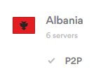
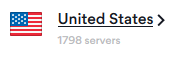

# NordVPN IP Tool
This tool can be used for gathering all [NordVPN](https://nordvpn.com/) IP addresses for Blacklists or other usage. Our logs reveal that NordVPN is used regularly by scammers to attempt fraud and attacks to our systems. To create a blacklist of all NordVPN's IP addresses, I wrote the following script.

* List of USA Servers: https://nordvpn.com/servers/
* Tool from NordVPN for subdomain format: https://nordvpn.com/servers/tools/

## Example
In the next few section, we will cover a few examples of how to use the script to generate the IP list(s).
### Albania (AL)
Albania (first on NordVPN list (alphabetical)). According to NordVPN's site, they have 6 servers so I entered 100 to be safe and we found 1 extra that was not listed on their site:



Run the script by passing the country code (initials) and server count number. 

*Notice that the subdomain name numbers may lie outside of the count number. For instance, USA (at the time of writing this) has 1798 servers - but a server number of 2971 exists (us2971.nordvpn.com). So, the count number should be adjusted until the total results from the script yeilds the count listed (or higher) on the NordVPN site. The count will begin at 0 and will stop at the count number*

```
root@demon:~$ ./nordvpn-blacklist-gen.sh al 100
al7.nordvpn.com:Address: 80.246.28.33
al8.nordvpn.com:Address: 80.246.28.35
al9.nordvpn.com:Address: 31.171.152.19
al10.nordvpn.com:Address: 31.171.152.11
al11.nordvpn.com:Address: 31.171.152.115
al12.nordvpn.com:Address: 31.171.152.235
al13.nordvpn.com:Address: 31.171.152.243
root@demon:~$ 
```
### United States (US)
USA (example used because that's where I live). According to NordVPN's site, they have 1798 servers so I entered 3000 to be safe.



```
root@demon:~/nordvpn-ip-tool$ ./nordvpn-blacklist-gen.sh us 3000
us324.nordvpn.com:Address: 104.200.65.178
us349.nordvpn.com:Address: 162.210.198.129
us350.nordvpn.com:Address: 162.210.198.130
us351.nordvpn.com:Address: 162.210.198.131
us352.nordvpn.com:Address: 162.210.198.132
us353.nordvpn.com:Address: 209.58.133.167
us354.nordvpn.com:Address: 209.58.133.168
us355.nordvpn.com:Address: 209.58.133.169
us356.nordvpn.com:Address: 209.58.133.170
us381.nordvpn.com:Address: 209.58.144.227
us382.nordvpn.com:Address: 209.58.144.228
us383.nordvpn.com:Address: 209.58.144.229
us384.nordvpn.com:Address: 209.58.144.230
us435.nordvpn.com:Address: 23.227.207.3
us436.nordvpn.com:Address: 23.227.207.4
us437.nordvpn.com:Address: 23.227.207.5
us438.nordvpn.com:Address: 23.227.207.6
us502.nordvpn.com:Address: 181.215.110.136
us503.nordvpn.com:Address: 181.215.110.137
us504.nordvpn.com:Address: 181.215.110.138
us505.nordvpn.com:Address: 181.215.110.139
us510.nordvpn.com:Address: 181.215.110.144
us511.nordvpn.com:Address: 181.215.110.145
us512.nordvpn.com:Address: 181.215.110.146
us513.nordvpn.com:Address: 181.215.110.147
...
```
### Mass Scan
You can use the [avail-country-list.txt](avail-country-list.txt) as input ins a simple loop to scan for all countries.
## Dependencies
Below is a list of the dependencies required for this script,
* [Linux](https://www.demonlinux.com/)
* [Bash](https://www.gnu.org/software/bash/)
* [host](https://linux.die.net/man/1/host)
* [printf](https://linux.die.net/man/3/printf)
